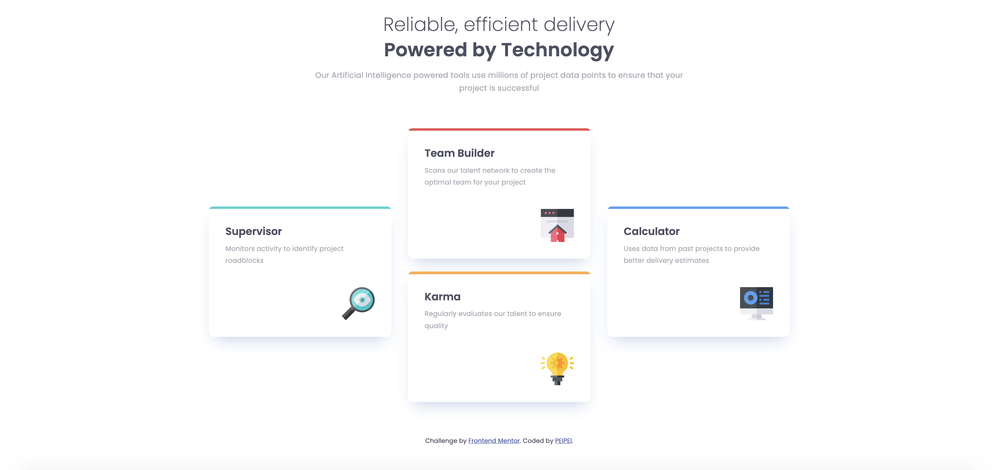

# Four Card Feature Section

This project is a Responsive Web Design of a Four Card Feature Section, built with HTML and CSS.

## Table of contents

- [Overview](#overview)
  - [The challenge](#the-challenge)
  - [Screenshot](#screenshot)
- [My process](#my-process)
  - [Built with](#built-with)
  - [What I learned](#what-i-learned)
  - [Continued development](#continued-development)
  - [Useful resources](#useful-resources)
- [Acknowledgments](#acknowledgments)

## Overview

### The challenge

Users should be able to:

- View the optimal layout for the site depending on their device's screen size

### Screenshot



## My process

### Built with

- Semantic HTML5 markup
- CSS custom properties
- Flexbox
- Mobile-first workflow

### What I learned

The main challenge I encountered --

- Images display different size based on the device width

The goal of this project is to achieve the desirable layout on mobile (width: 375px) and desktop (width:1440px). I want to make the small image icon in each card adjust to different screen width.

My solution is to set the img width to percentage of its container:

```css
img {
  max-width: 22%;
  margin-top: auto;
  align-self: flex-end;
}
```

Even though it's not pixel perfect to its Figma design, but I'm happy with the result!

- Use Flexbox to make mobile/desktop layout easier

I structured the four-card layout with Flexbox, following the Mobile-First-Workflow. 

In index.html, I set the cards into three columns --

```html
<div class='row'>
  <div class='col'>
    <!-- Card one: Supervisor -->
  </div>

  <div class='col'>
    <!-- Card two: Team-Builder -->
    <!-- Card three: Karma -->
  </div>

  <div class='col'>
    <!-- Card four: Calculator -->
  </div>
</div>
```

And set row to Flexbox in CSS. 

```css
.row {
  display: flex;
  flex-direction: column;
  max-width: 85%;
  margin: 0 auto;
}
```

For Desktop UI, one only needs to change the flex-direction to 'row' in media query to achieve the three-column layout.

### Continued development

Any feedback is welcomed!

### Useful resources

- [Normalize CSS](https://necolas.github.io/normalize.css/) 

## Acknowledgments

### Frontend Mentor - Four card feature section solution

Frontend Mentor challenges help you improve your coding skills by building realistic projects. 